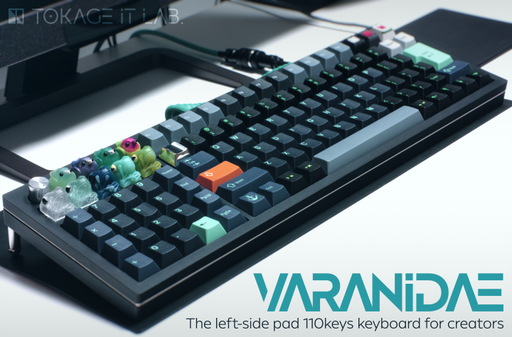
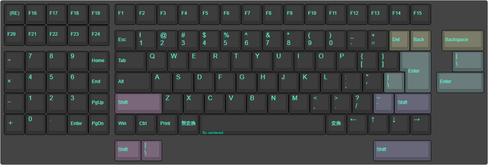
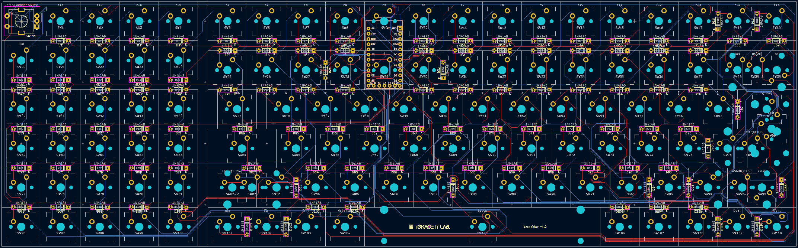
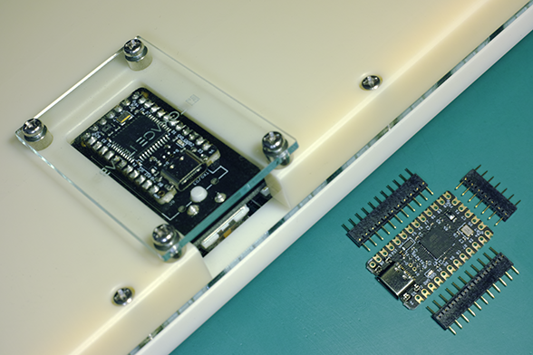
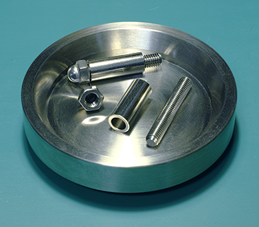

# Varanidae



## Consepts / Ideology

This keyboard layout may look pretty Mad and Hacky at some parts, but there are proper reasons for each of them.

<details>
<summary>Simple implementation</summary>

We are not electronics professionals and do not like to implement complex PCBs. SMT may be efficient in using reflow, but it is hard for beginners, so we only use Through-hole components.

And to make implementation easier, we need to adopt Elite-C. However, Elite-C requires more space, so we solved this problem by overlapping it with other switches using a tall pin header.

In addition, to simplify the CNC manufacturing process, we had to design a case that could be machined with a 3-axis CNC. This makes it possible to output cases with some CNC services without complex communication with the manufacturers.

</details>

<details>
<summary>Compact layout for international</summary>

When we work, we place the pen tablet in front of the keyboard, thus making the desk smaller. So we needed to make the keyboard as compact as possible.

So we omitted some **outdated** keys (PauseBreak/ScrollLock/Insert/CapsLock) and adopted a 6U space bar. This allows us to provide almost a full keyboard (or more) functionality and place keys for language switching.

</details>

<details>
<summary>Left-side pad</summary>

We work with Blender and a pen tablet. Then, we hold the pen in our right hand, so we prefer to place the numpad (which has a lot of camera shortcuts assigned) in the left-side of the keyboard.

</details>

<details>
<summary>F13-F24 keys</summary>

We favor the F13-F24 keys for shortcuts. They avoid conflicts with the default shortcuts of any software and they are useful for resident application shortcuts.

I recommend to all keyboard manufacturers worldwide to implement F13-24 keys instead of having macro keys, or to allow F13-F24 keys to be assigned to the macro keys.

</details>

<details>
<summary>Backspace and Enter are the end of the right</summary>

We do not want to make more distance between the mouse, trackball, or trackpad and the keyboard. Also, since we use the Backspace and Enter keys so often, having them to the right of those keys can cause us to press other keys by accident.

Moreover, as an overlooked point, if the right-side of the Backspace and Enter keys are free, we can put our hand there to rest.

</details>

<details>
<summary>Lined up arrow keys</summary>

On common keyboard layout them in an inverted T-shape, but on some keyboards they are frequently in a single row to omit spaces.

However, in that case, the order is generally: "Left", "Down", "Up", "Right".

Perhaps this is because that, when you play games that use the arrow keys with the index finger in the Left and ring finger in the Right home position, the middle finger muscle tendon is pulled toward the ring finger.

But out of the game, this is unnatural considering the affordances. In the script editor, Up means "back a line", so we think it would be more natural to have it next to Left which means "back a character".

So this keyboard adopts the order: "Left", "Up", "Down", "Right" as default.

</details>

<details>
<summary>Compressed numpad</summary>

We should not need uselessly large + and Enter keys on numpad. More to the point, NumLock is not needed either. In that case, four basic math symbols can be placed vertically in one column.

Also, in fact, it is possible to place the Home/End/PgUp/PgDn keys symmetrically with those four keys, so we integrated them into one island.

This makes it possible to place keys for line transitions or Blender shortcuts without placing them to the right of Backspace and Enter.

</details>

<details>
<summary>R4 Tilda</summary>

The last mad point is that placing the Tilda at the end of R4. Because it is not used that often or the cases where it is used are quite special.

I believe that it is most reasonable to put Tilda at the end of R4. You may see a layout similar to this on some keyboards, such as Toshiba - Dynabook, but I don't understand why R4 Tilda is not more common.

I am saddened that there is no R4 Tilde in any GMK sets (and the same applies to the keys in the columns at both ends of compressed numpad).

</details>

Now, we finally got a keyboard that is very reasonable for us.

We hope that this layout will become more common and that the R4 Tilde will be included in some GMK set, so we are releasing it as an open source keyboard.

The license is all that is written in this repository, so this is no needed thing, but if you have any information about a derivative product of Varanidae or the R4 Tilde, we would be glad to hear about that.

Of course, simple feedbacks are also welcome.

## Supported layout



The rotary encoder is assigned to the middle click and vertical scrolling by default.

Varanidae supports [VIA](https://usevia.app/), so the key/encoder assignments can be changed.

---

**Note:** This keyboard is mainly designed for Japanese users, but uses the US layout. If you are using a JIS keyboard on the system, you will need to select the US keyboard layout (101/102 keys keyboard) in the "Language Settings".

**For example in Windows 10:**

「設定」→「時刻と言語」→「言語」→「優先する言語」→「日本語: オプション」→「ハードウェア キーボード レイアウト」→「レイアウトを変更する」→「英語キーボード (101/102 キー)」

---

## Description

This repository contains:

- case
  - ai
    - Vector file of the plates
    - **The plates are assumed to be 2mm thick, please note when ordering plates using this file**
  - f3d
    - Fusion 360 project file of the case
  - step
    - STEP files for CNC, output from Fusion 360 project
    - It may be necessary to refer to the Fusion 360 project to determine the exact hole type
    - **If you make the order with these files, pay attention to the type of threaded holes[^1]**
- img
  - Images for the readme
- pcb
  - kicad
    - KiCad project files of the PCB (include exported Gerber files)



Is ordering CNC expensive and complicated? [Varanidae Soul](https://github.com/TokageItLab/Varanidae_Soul) the simplified version of Varanidae only requires acrylic plates and screws. It is reasonable choice to try the Varanidae layout.

## Other required components

### For the PCB
- MX Keycap set x1 (**6u centerd space is required**)
- MX stabilizer set x1 (**6u wire is required, PCB mounted is required if you use hybrid layout**)
- MX stem switches x110
- Diodes 1N4148 x110
- Rotary encoder EC11 x1 (EC11N1525404 or EC11N1525402 is recommended)
- Knob x1 (**14mm diameter or less are strongly recommended since the case hole diameter is 15mm for the knob**)
- Elite-C x1
- Pin headers 5mm height x29 (For Elite-C, so **x11 + x11 + x7** or **x12 + x12 + x5** is reccomended)



---

**Note:** If you don't use the "spring" pin headers and need to solder the pin headers to the PCB, be careful about the working sequence. You must solder only the pin headers before mounting the switch, and the Elite-C must be soldered after the switch is mounted.

---

### For the case

#### To screw the case and the main plate
- M3 screws 15mm x20

#### To screw the bottom plate
- M3 screws 8mm x4
- M3 pipe spacers 4mm x4

#### To assemble the case legs with screws
- M5 full thread screws 34mm x2
- M5 pipe spacers 20mm x2
- M5 cap nuts 4mm depth x2



---

**Note:** The length of the case leg screw should be calculated based on the length of the leg and the depth of the cap nut you wish to use. For example, the screw and nut length are calculated as follows:

```
screw length (34mm) = spacer length (20mm) + cap nut depth (4mm) + depth of the case threaded hole which will be inserted the screw (10mm)
```

---

## Using libraries

- [kbd](https://github.com/foostan/kbd) - foostan (MIT license)
- [keebio-components](https://github.com/keebio/keebio-components) - Keebio (MIT license)
- [Keebio-Parts.pretty](https://github.com/keebio/Keebio-Parts.pretty) - Keebio (MIT license)
- [KiCad Footprint Libraries](https://gitlab.com/kicad/libraries/kicad-footprints/-/tree/master?ref_type=heads) - KiCad ([KiCad Libraries License](https://gitlab.com/kicad/libraries/kicad-footprints/-/blob/master/LICENSE.md))
- [MX_Alps_Hybrid](https://github.com/ai03-2725/MX_Alps_Hybrid/tree/master/Alps_Only.pretty) ([my fork](https://github.com/TokageItLab/MX_Alps_Hybrid/tree/Varanidae)) - ai03 (MIT license)

## Special thanks (Artisan keycaps for the thumbnail)

- Birb - [KEYMAKER](https://www.keymakerartisankeycaps.com/)
- Space 無 - [GEEKKEEY](https://www.instagram.com/geekkeey/)
- The 925 - [THOK](https://thok.design/)
- THINK - [BOXXX KEYCAP](https://boxxx.booth.pm/)

## License

MIT license except that the Tokage IT Lab.'s logo is CC BY-NC-ND 4.0. This means that if you want to manufacture and sell the derived PCBs, you can do so by removing the Tokage IT Lab.'s logo from them[^2].

Also, if you redistribute the libraries used in the KiCad projects, you must respect their libraries' license.

[^1]: One actual case that has happened is that when using [meviy](https://meviy.misumi-ec.com), the M5 screw holes for screwing the feet to the bottom case are detected as not being drilled all the way through (they look through, but are not drilled all the way through). In this case, you need to specify to drill the M5 hole all the way through on the meviy web app.

[^2]: However, credit must be placed somewhere for derivatives to follow the MIT license. This doesn't mean printing the credit on the PCB, but only having it somewhere, such as on a github repository, promotional page, paper manual or etc.
